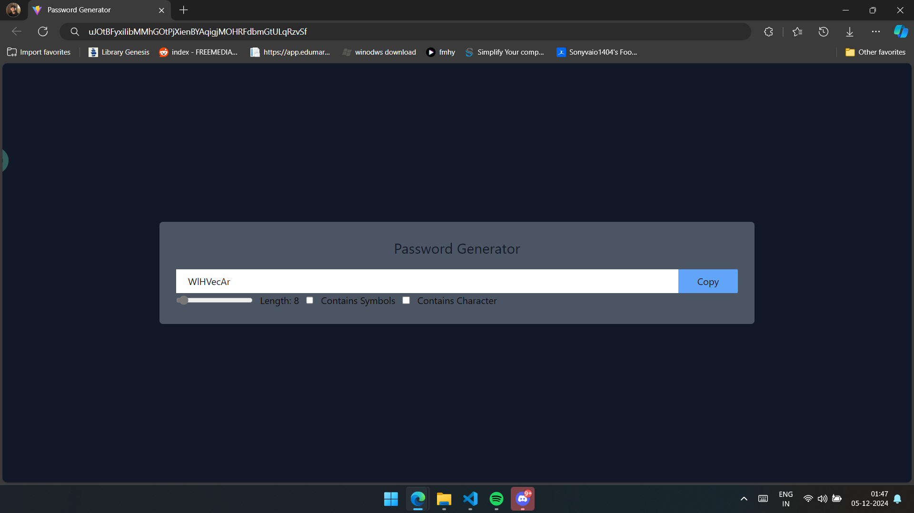

# ReactGrind Projects

This repository contains my practice projects for learning React. Each project focuses on different concepts to build a strong foundation in React development.

---

## 1. reactVite

In this project, I learned how to set up a barebone React app using Vite and explored the basics of state management with `useState`. This project is a simple yet effective starting point for understanding React.

---

## 2. reactViteTailwind

This project integrates Tailwind CSS with React. I learned how to style components using utility-first CSS classes and explored how to use React components and props effectively.

---

## 3. bgColorChanger

This basic project focuses on React DOM manipulation. It allowed me to understand how React interacts with the DOM to dynamically update elements, providing a solid introduction to interactivity in React apps.

---

## 4. Password Generator

In this project, I learned about `useEffect`, `useCallback`, and `useRef` to create a dynamic password generator. This project helped me understand how to manage side effects, optimize callback functions, and use references in React effectively.

---

Each project builds on the previous ones to deepen my understanding of React concepts. Feel free to explore the code and run the projects yourself to see them in action!
